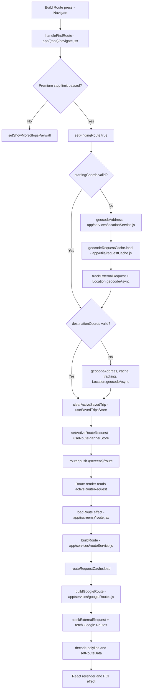
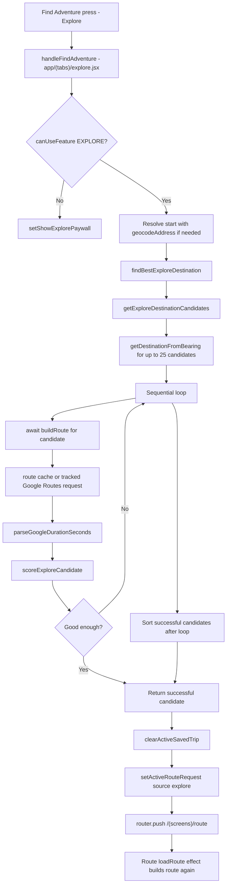
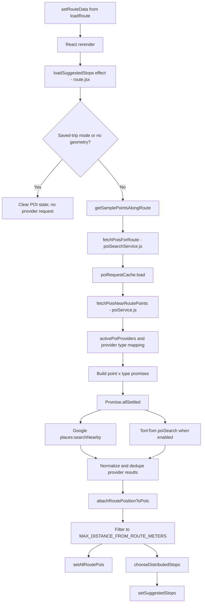
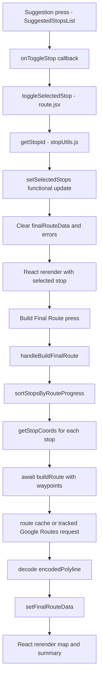
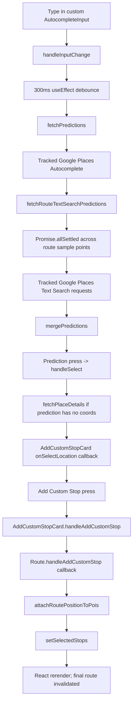
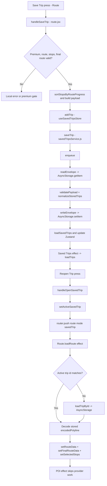

# WanderNorth execution flow

This document describes the code present in this repository on 2026-07-12. It is a static trace: no provider request was made while producing it. Paths are repository-relative.

## How to read this document

- **Verified** means the behavior is directly visible in the checked-in source.
- **Runtime-dependent** means the branch is verified, but its outcome depends on environment variables, permissions, network/provider responses, or persisted device data.
- **Assumption** is used only where JavaScript, React, Expo Router, or native platform behavior cannot be proven by static inspection.
- `useRoutePlannerStore`, `useSavedTripsStore`, and `useEntitlementStore` are Zustand stores. Calling one of their setters synchronously changes the store and notifies subscribed React components; the resulting render timing is controlled by React.
- Demo mode (`app/config/demoMode.js`) replaces route, POI, and autocomplete provider work with fixtures. The normal-provider paths below apply when demo mode is off.

## Cross-cutting request infrastructure

All three in-memory request caches are created in `app/services/apiRequestCaches.js` by `createRequestCache` from `app/utils/requestCache.js`.

| Cache | Key builder | TTL | Maximum entries | Used for |
|---|---|---:|---:|---|
| `routeRequestCache` | `createRouteRequestKey` in `app/utils/requestKeys.js` | 3 minutes | 40 | Google Routes results, including waypoint order |
| `poiRequestCache` | `createPoiRequestKey` in `app/utils/requestKeys.js` | 10 minutes | 40 | Whole route-POI batches, including provider ids |
| `geocodeRequestCache` | normalized lower-case address string | 20 minutes | 75 | Forward geocoding |

`createRequestCache.load` first checks the completed-result `Map`, then the in-flight `Map`. A completed hit returns a deep JSON clone. A matching in-flight request returns the same Promise, preventing a duplicate request. A miss runs `loader`, stores a clone with an expiry, evicts the least-recently-used first entry when over capacity, and removes the in-flight entry in `finally`. `clearApiRequestCaches` clears completed entries only; it does not clear the in-flight maps.

`app/services/apiUsageTracker.js` keeps process-memory counters. `recordHighLevelOperation` counts app operations, `recordCacheHit` and `recordInFlightDeduplication` count cache behavior, and `trackExternalRequest` wraps actual request loaders to count started, succeeded, failed, and currently-in-flight work. `ApiUsageDevCard` in `app/components/ApiUsageDevCard.jsx` subscribes through `subscribeToApiUsage`; tracker updates call listeners and therefore trigger its React rerender. Counters and caches are not persisted.

## 1. Build a route from Navigate

### Mermaid flowchart

### Numbered walkthrough

1. **UI event — verified.** `WNButton` in `app/(tabs)/navigate.jsx` receives `handleFindRoute` as `onPress`. The handler reads `startingAddress`, `destinationAddress`, coordinate objects, `selectedTravelMode`, `numStops`, and `selectedPoiTypes` from `useRoutePlannerStore`.
2. **Entitlement guard — verified.** `handleFindRoute` compares `Number(numStops)` with `getFeatureLimits(subscriptionTier).maxSuggestedStops`. An over-limit request only calls local React state setter `setShowMoreStopsPaywall(true)` and returns before geocoding or routing.
3. **Loading boundary — verified.** `setFindingRoute(true)` schedules a rerender to `RouteBuildingScreen`. The remainder of the async handler continues; the render does not cancel it.
4. **Origin resolution — verified.** If `isValidCoords(startingCoords)` is false, `handleFindRoute` awaits `geocodeAddress(startingAddress)` in `app/services/locationService.js`. It normalizes the address for a cache key and awaits `geocodeRequestCache.load`. On a miss, the loader calls `trackExternalRequest("google", "geocoding", ...)`, which awaits Expo Location's `Location.geocodeAsync`. A valid first result becomes `{ latitude, longitude }` and is written through Zustand action `setStartingCoords`. Invalid/no result shows an alert and returns.
5. **Destination resolution — verified.** The same sequence runs for `destinationCoords` and `destinationAddress`, then calls `setDestinationCoords` when successful. These two geocodes are sequential, not `Promise.all`.
6. **Saved-trip isolation — verified.** `clearActiveSavedTrip` in `app/store/useSavedTripsStore.js` writes `activeSavedTrip: null` so a prior reopen cannot supply the Route screen's request.
7. **Request snapshot — verified.** `setActiveRouteRequest` in `app/store/useRoutePlannerStore.js` writes a new object with `source: "navigate"`, display addresses, resolved coordinates, travel mode, stop count, and POI categories. Subscribers rerender.
8. **Navigation — verified.** `router.push` navigates to `/(screens)/route` with `returnTo: "/(tabs)/navigate"`. The route request itself is not passed in URL parameters; the Route screen reads it from Zustand.
9. **Route effect — verified.** On mounting `Route` in `app/(screens)/route.jsx`, the first `useEffect` calls its nested `loadRoute`. It clears route/POI/selection/final-route local state, validates the Zustand request, copies it to `parsedParams`, and awaits `buildRoute(parsedParams)`.
10. **Route service/cache — verified.** `buildRoute` in `app/services/routeService.js` records `app:build-route`. Demo mode returns `Promise.resolve(createDemoRoute(params))`. Otherwise it creates a coordinate/mode/waypoint key with `createRouteRequestKey` and calls `routeRequestCache.load`. Cache hits and in-flight deduplication are tracked as `google:routes`.
11. **External provider request — verified branch, runtime-dependent result.** On a cache miss, `buildGoogleRoute` in `app/services/googleRoutes.js` maps the travel mode using private `convertModeToGoogleMode`, constructs a Google Routes v2 `computeRoutes` POST body, and calls `trackExternalRequest("google", "routes", () => fetch(...))`. It awaits both `fetch` and `response.json`, rejects non-OK/no-route responses, then returns normalized distance, duration, encoded polyline, and legs.
12. **Route state/rerender — verified.** `loadRoute` decodes the encoded polyline using `@mapbox/polyline`, adds `routeCoords` and `parsedParams`, then calls `setRouteData`. `finally` calls `setLoading(false)`. Each state update can schedule a render. The cleanup closure flips `isCurrent` so a settled Promise does not update an unmounted/stale effect instance; it does not abort the provider request.

The autocomplete selection path that usually supplies valid coordinates is: `handleInputChange` -> debounced `fetchPredictions` -> tracked Google Places Autocomplete request -> prediction press -> `handleSelect` -> optional `fetchPlaceDetails` -> Navigate's `onSelectLocation` callback -> Zustand `setStartingAddress`/`setStartingCoords` or destination equivalents. If coordinates are already present, `handleFindRoute` skips forward geocoding.

## 2. Build an adventure from Explore

### Mermaid flowchart

### Numbered walkthrough

1. **UI event — verified.** The Explore `WNButton` passes `handleFindAdventure` as `onPress` in `app/(tabs)/explore.jsx`. The handler reads planner fields from `useRoutePlannerStore`; direction and travel time are component-local state.
2. **Premium boundary — verified.** `canUseFeature(subscriptionTier, FEATURES.EXPLORE)` is computed through `app/config/featureAccess.js`. A free user gets `setShowExplorePaywall(true)` and returns before geocoding or routing.
3. **Derived inputs — verified.** `useMemo` selects the `DIRECTIONS` entry and computes `estimatedStraightLineDistanceKm` from `AVERAGE_SPEED_BY_MODE_KMH`, selected minutes, and `STRAIGHT_LINE_ROUTE_FACTOR`. Changes to dependencies recompute during render.
4. **Start resolution — verified.** `handleFindAdventure` sets local `buildingAdventure`, then uses the same `isValidCoords`/`geocodeAddress` cache-and-tracking chain described in Flow 1 when necessary.
5. **Candidate generation — verified.** It awaits `findBestExploreDestination`. That function calls `getExploreDestinationCandidates`, which combines five bearing offsets with five distance multipliers. Each combination calls `getDestinationFromBearing`, using `toRadians`, `toDegrees`, and `normalizeLongitude`; the list is capped at `MAX_EXPLORE_CANDIDATES` (25).
6. **Sequential async loop — verified.** `findBestExploreDestination` deliberately loops one candidate at a time and awaits `buildRoute`. It does not use `Promise.all`, limiting simultaneous Routes calls. Each candidate still passes through route caching/deduplication/tracking and may make a Google Routes request.
7. **Candidate scoring — verified.** A successful route's duration passes through `parseGoogleDurationSeconds`; `getSmallestBearingDifferenceDegrees`, `getAcceptableDurationDeltaSeconds`, and `scoreExploreCandidate` calculate fit. A candidate within the duration tolerance and 30 degrees returns immediately. Otherwise all successful candidates are sorted by `candidateScore`; `null` is returned if every route failed.
8. **Important duplicate work — verified.** The chosen candidate contains `routePreview`, but `handleFindAdventure` stores only its coordinates/duration-derived label. It does not pass `routePreview` to Route. After navigation, Route calls `buildRoute` again. Because the same coordinate/mode key was just completed, this will normally be an in-memory cache hit; if the cache was cleared/expired or keys differ at runtime, another provider request can occur.
9. **Zustand and navigation — verified.** `clearActiveSavedTrip` clears saved context. `setActiveRouteRequest` writes `source: "explore"`, start data, generated destination label/coordinates, travel mode, stop request, and categories. `router.push` navigates to `/(screens)/route` with `returnTo: "/(tabs)/explore"`.
10. **Route screen continuation — verified.** The Route screen then follows steps 9–12 of Flow 1. `finally` in `handleFindAdventure` clears `buildingAdventure`, even after early return or error propagation.

## 3. Load suggested POIs on Route

### Mermaid flowchart

### Numbered walkthrough

1. **Trigger — verified.** This flow has no separate button. The UI-enabling event is the earlier Build Route/Find Adventure press. After `setRouteData`, React rerenders and the second `useEffect` in `app/(screens)/route.jsx` calls nested `loadSuggestedStops` because `routeData` is a dependency.
2. **Skip branches — verified.** Requested saved-trip mode clears POI state and returns. Missing/empty `routeCoords` also returns. A `numStops` value of zero still enters the effect, but `fetchPoisNearRoutePoints` returns before provider calls.
3. **Sampling — verified.** `getSamplePointsAlongRoute` in `app/utils/routeSampling.js` calculates cumulative Haversine distance with `getDistanceMeters` and selects coordinates near 15%, 30%, 50%, 75%, and 95% of route distance. Invalid distance calculations fall back to index-based sampling. Duplicates/invalid coordinates are removed.
4. **Batch service/cache — verified.** `fetchPoisForRoute` in `app/services/poiSearchService.js` records `app:fetch-route-pois`. Demo mode resolves fixture clones. Otherwise `createPoiRequestKey` includes sampled coordinates, selected category order, `numStops`, and active provider ids. `poiRequestCache.load` tracks completed/in-flight hits as `poi-batch:route-pois`.
5. **Provider matrix — verified.** On a cache miss, `fetchPoisNearRoutePoints` in `app/services/poiService.js` validates `numStops`, chooses at most five evenly spaced input points, loops through `activePoiProviders`, maps app categories with each provider's `getProviderPoiTypes`, reprioritizes with `prioritizeProviderPoiTypesForSearch`, and keeps at most two provider types. It creates one Promise per point/type, with five results requested per call.
6. **External provider requests — verified branches, runtime-dependent activation/results.** Google is always active outside demo mode: `googlePoiProvider.fetchPoisForRoutePointAndType` in `app/services/poiProviders/googlePoiProvider.js` calls tracked operation `google:places-nearby` and POSTs to Google Places `places:searchNearby`, then normalizes with private `normalizeGooglePlace`. TomTom is active only when `EXPO_PUBLIC_ENABLE_TOMTOM_POIS === "true"`: its same-named function in `tomtomPoiProvider.js` calls tracked `tomtom:poi-search`, GETs TomTom POI Search, and normalizes with private `normalizeTomTomResult`.
7. **Concurrency — verified.** Provider functions begin when their Promises are pushed. `Promise.allSettled(requests)` waits concurrently and preserves partial success. All failures, or more than half failures, throw; otherwise rejected batches are logged and ignored.
8. **Deduplication — verified.** Private `dedupePois` removes repeated stable provider ids. `dedupeLikelySamePlacesAcrossProviders` uses private name normalization/similarity plus a 75-metre coordinate test, preferring the Google record. This is result deduplication, distinct from request in-flight deduplication.
9. **Route metadata — verified.** Back in Route, `attachRoutePositionToPois` calls `getClosestRoutePointInfo` for each POI. The utility measures nearest route segment and cumulative progress, with a closest-coordinate fallback, adds distance/progress fields, and sorts by progress.
10. **Filtering and ranking — verified.** Route filters out POIs farther than `MAX_DISTANCE_FROM_ROUTE_METERS` (3,000 metres), stores the remaining full pool with `setAllRoutePois`, canonicalizes preferred categories with `getCanonicalPoiCategoryIds`, then calls `chooseDistributedStops` in `app/utils/poiScoring.js`. That function validates candidates, scores them, distributes them across progress buckets, prefers requested-category coverage, fills gaps, and returns route-ordered suggestions. `setSuggestedStops` schedules the displayed lists to rerender.
11. **Stale-result guard — verified.** Effect cleanup sets `isCurrent = false`; state writes are skipped after dependency change/unmount, but active provider requests are not cancelled.
12. **Lazy detail requests — verified.** `SuggestedStopsList` may separately call `fetchGooglePlaceDetailsForStop` in `app/services/googlePlaces.js` through its `loadDetails` callback when its detail UI is opened. That tracked `google:place-details` GET enriches title/address/photos/editorial text/rating/Maps URI. It is not part of the initial batch, is not routed through a request cache, and only works for stops with a Google place id.

## 4. Select a stop and build the final route

### Mermaid flowchart

### Numbered walkthrough

1. **UI selection event — verified.** A `Pressable` inside `SuggestedStopsList` calls its `onToggleStop(stop)` prop. Route passes `toggleSelectedStop` for both Top Suggestions and category lists.
2. **Identity/limits — verified.** `toggleSelectedStop` calls `getStopId` from `app/utils/stopUtils.js`, clears save status, and uses the functional form of `setSelectedStops`. Existing ids are removed; new stops are appended unless `isAtSelectedStopLimit` triggers the premium gate. A legacy saved transit trip is read-only.
3. **Invalidation — verified.** Any successful add/remove sets `finalRouteData` and `finalRouteError` to null. In saved-trip mode it also sets `hasUnsavedSavedTripChanges(true)`. These local state writes rerender selected markers/lists and expose the Build Final Route button when at least one stop exists.
4. **UI build event — verified.** `WNButton` in Trip Actions calls `handleBuildFinalRoute`.
5. **Guards — verified.** The handler rejects legacy transit, zero stops, too many total stops, too many custom stops, and any stop without coordinates.
6. **Waypoint order — verified.** `sortStopsByRouteProgress` orders a copy by `routeProgress`, then `closestRouteIndex`, then zero. `getStopCoords` accepts several normalized/provider shapes. The resulting waypoint coordinate array must match selected-stop count.
7. **External route request path — verified.** `handleBuildFinalRoute` awaits `buildRoute` with original endpoints/travel mode and the ordered `waypoints`. The waypoint list is part of `createRouteRequestKey`, so a different stop/order creates a different route-cache entry. A miss calls tracked Google Routes as in Flow 1, now placing waypoints in the request's `intermediates` array.
8. **Final UI — verified.** The encoded polyline is decoded; `setFinalRouteData` stores the normalized result, decoded coordinates, and current selected stops. React rerenders `MapComponent` and `RouteSummaryCard` from `displayedRouteData = finalRouteData ?? routeData`. The original `routeData.routeCoords` remains the reference geometry for POI progress and custom-stop attachment.

## 5. Add a custom stop

### Mermaid flowchart

### Numbered walkthrough

1. **Derived search geography — verified.** Route calculates `customStopLocationBias` from the original route midpoint and calls `getSamplePointsAlongRoute` for `customSearchPoints`. It passes both into `AddCustomStopCard`, which passes them to `AutocompleteInput` with inline dropdown and `autocompleteTypes={null}`.
2. **Typing event/debounce — verified.** `AutocompleteInput.handleInputChange` sets local `isTyping`, updates `input`, and calls `AddCustomStopCard`'s `onChangeText`, which clears previously selected coordinates/metadata. A `useEffect` waits 300 ms; cleanup cancels the timer after newer input. It then calls async `fetchPredictions`.
3. **Autocomplete request — verified.** Outside demo mode, `fetchPredictions` calls tracked `google:places-autocomplete` against the legacy Google Places Autocomplete JSON endpoint, using country Canada, midpoint location bias, and no type restriction for this card.
4. **Route-aware text requests — verified.** After autocomplete returns, custom-stop conditions call `fetchRouteTextSearchPredictions`. It searches at most five valid route sample points concurrently with `Promise.allSettled`, each via tracked `google:places-text-search` POST to Places v1 `places:searchText`, with a 12,000-metre circle and five-result limit. Failed point searches are silently omitted. `mergePredictions` removes duplicate place ids and puts text-search results first.
5. **Stale callback protection — verified.** `latestPredictionRequestId` increments for each fetch/selection. Results from an older request return without setting state. This prevents stale UI updates but does not abort the HTTP calls.
6. **Prediction selection — verified.** The prediction `Pressable` calls `handleSelect`. It closes UI, optimistically updates the parent, then either uses coordinates embedded in a demo prediction or awaits private `fetchPlaceDetails`, a tracked `google:place-details` request to the legacy details JSON endpoint. Text-search normalized predictions do not retain `place.location`, so they also take this details path.
7. **Component callback — verified.** `handleSelect` calls `AddCustomStopCard`'s `onSelectLocation(address, coords, metadata)`, which stores local address, coordinate, and place metadata. These React state updates rerender the card.
8. **Add button event — verified.** The `Add Custom Stop` `WNButton` calls `AddCustomStopCard.handleAddCustomStop`. It validates non-empty text and selected coordinates, derives name/address, constructs a custom object with a generated id and Google place id, then calls Route's `handleAddCustomStop` prop callback.
9. **Route attachment — verified.** `Route.handleAddCustomStop` enforces route readiness, transit/entitlement/total-stop limits, then calls `attachRoutePositionToPois([customStop], routeData.routeCoords)`. It invalidates `finalRouteData`, marks reopened trips dirty, and appends the route-aware stop with functional `setSelectedStops`.
10. **Next step — verified.** Adding the stop does not automatically rebuild the final route. The user must follow Flow 4's Build Final Route action.

There is no request cache or in-flight request deduplication in `AutocompleteInput`; its debounce and request-id guard reduce UI churn but do not reuse or cancel provider work.

## 6. Save and reopen a trip

### Mermaid flowchart

### Numbered walkthrough

1. **Save UI event — verified.** Route's Save/Update `WNButton` calls `handleSaveTrip`.
2. **Guards — verified.** `handleSaveTrip` clears old status, checks `featureLimits.canSaveTrips`, requires `routeData`, at least one selected stop, and `finalRouteData`. Thus an initial route cannot be saved until Flow 4 builds a final route.
3. **Payload — verified.** The handler route-orders stops and creates `savedTripPayload` with title, source, original `routeRequest`, summary metrics, final route metrics/encoded polyline, selected stops/categories, and stop count. New titles come from `buildSavedTripTitle`; updates preserve `activeSavedTrip.title` when present.
4. **Store boundary — verified.** A new save awaits `useSavedTripsStore.addTrip`; a reopened save awaits `updateTrip(activeSavedTrip.id, payload)`. Loading/error/message flags are local React state; `savedTrips`, `activeSavedTrip`, and `savedTripsError` are Zustand state.
5. **Serialized local persistence — verified.** `addTrip` calls service `saveTrip` in `app/services/savedTripsService.js`. `saveTrip` calls private `enqueue`, which chains the operation behind module-level `operationTail`; all service reads/writes are serialized Promises, preventing overlapping AsyncStorage read-modify-write operations.
6. **Read/validate/write — verified.** `readEnvelope` awaits `AsyncStorage.getItem`, parses JSON, supports a legacy top-level array, validates schema 2, calls `normalizeStoredTrips`, sorts newest-first, and may write normalized/migrated data. `saveTrip` calls `validatePayload`, creates/preserves id and timestamps, normalizes, then `writeEnvelope` awaits `AsyncStorage.setItem` under key `wanderNorth.savedTrips.v1`.
7. **Zustand refresh — verified.** `addTrip` then awaits `loadSavedTrips`, which re-enters the same serialized service chain after the completed save, and sets Zustand `savedTrips`. A successful save sets local confirmation text. No network/provider call occurs.
8. **Saved screen load — verified.** When `SavedTrips` in `app/(tabs)/saved-trips.jsx` renders with entitlement, its `useEffect` calls Zustand `loadTrips`. `loadTrips` toggles `loadingSavedTrips`, awaits service `loadSavedTrips`, then writes the list/error/recovery state and schedules a rerender.
9. **Reopen UI event/navigation — verified.** `SavedTripCard` invokes the `onOpen` callback; `handleOpenSavedTrip(trip)` writes the whole record to Zustand using `setActiveSavedTrip`, then `router.push` navigates to `/(screens)/route` with `returnTo`, `savedTripId`, and `mode: "savedTrip"` URL params.
10. **Reopen effect — verified.** Route derives `isSavedTripMode` only when mode and ids match. Nested `loadRoute` uses the existing `activeSavedTrip`; if it does not match, it awaits Zustand `loadTripById`, which calls service `loadSavedTripById` -> `enqueue` -> `readEnvelope` and updates `activeSavedTrip`.
11. **Restore, not rebuild — verified.** Route validates stored request/polyline, decodes the saved final polyline, and directly calls `setRouteData`, `setFinalRouteData`, and `setSelectedStops`. It does not call `buildRoute`. The POI effect sees `requestedSavedTripMode` and clears/skips suggestions, so reopen makes no route or POI provider requests.
12. **Editing/update — verified.** Changing reopened stops invalidates `finalRouteData` and marks the trip dirty. The user must rebuild the final route before `handleSaveTrip` can call `updateTrip`. Store `updateTrip` calls service `updateSavedTrip`, which preserves id/created timestamp, validates the merged record, writes it, reloads all trips, and updates matching `activeSavedTrip`.

## Verified external-provider request inventory

| Caller | Tracked id | External operation | Cache/dedupe |
|---|---|---|---|
| `geocodeAddress` — `app/services/locationService.js` | `google:geocoding` | `Location.geocodeAsync` | `geocodeRequestCache` |
| `getCurrentLocationWithLabel` — same file | `google:reverse-geocoding` | `Location.reverseGeocodeAsync` after device permission/location | None |
| `buildGoogleRoute` — `app/services/googleRoutes.js` | `google:routes` | Google Routes v2 `computeRoutes` POST | `routeRequestCache` in caller |
| Google `fetchPoisForRoutePointAndType` — `app/services/poiProviders/googlePoiProvider.js` | `google:places-nearby` | Places v1 Nearby Search POST | Whole batch cached by `poiRequestCache` |
| TomTom `fetchPoisForRoutePointAndType` — `app/services/poiProviders/tomtomPoiProvider.js` | `tomtom:poi-search` | TomTom POI Search GET | Whole batch cached by `poiRequestCache` |
| `fetchPredictions` — `app/components/AutoCompleteInput.jsx` | `google:places-autocomplete` | Places Autocomplete JSON GET | None; 300 ms debounce only |
| `fetchRouteTextSearchPredictions` — same file | `google:places-text-search` | Places v1 Text Search POST per route point | None; concurrent `Promise.allSettled` |
| private `fetchPlaceDetails` — same file | `google:place-details` | Legacy Place Details JSON GET | None |
| `fetchGooglePlaceDetailsForStop` — `app/services/googlePlaces.js` | `google:place-details` | Places v1 details GET | None |

`trackExternalRequest` labels Expo geocoding as Google, but the exact native geocoder/provider selected by Expo Location is platform/runtime-dependent. That provider identity is an assumption in tracker naming, not statically proven network behavior.

## Dead ends, duplication, and static-analysis limits

### Verified dead ends or unused exports

- `normalizeSelectedPoiTypes` exported from `app/services/poiService.js` has no repository caller. Provider-specific versions are used through provider objects.
- `availablePoiProviders` from `app/services/poiProviders/index.js` has no repository caller; `activePoiProviders` and `primaryPoiProvider` are used.
- `clearActiveRouteRequest` from `app/store/useRoutePlannerStore.js` has no repository caller. `resetRoutePlanner` clears the same field as part of a larger reset.
- `fetchGooglePlaceDetailsForStop` is not a dead end: its caller is `SuggestedStopsList.loadDetails`.
- `clearApiRequestCaches` is not a dead end: `ApiUsageDevCard` wires it to a development button.

### Verified duplicated or overlapping logic

- Navigate and Explore duplicate `getCurrentLocation`, travel-mode correction effects, planner inputs, reset concepts, and the clear-saved-trip -> set-active-request -> route-navigation sequence.
- Route building occurs in Explore candidate probing and again after navigation. The second call normally reuses `routeRequestCache`, but the `routePreview` object itself is discarded.
- Two different functions named `fetchPoisForRoutePointAndType` exist, one per provider. This is intentional interface duplication; calls are dynamically dispatched through provider objects.
- Two Google place-detail paths exist: private legacy `fetchPlaceDetails` in `AutoCompleteInput.jsx` for coordinate resolution, and `fetchGooglePlaceDetailsForStop` in `googlePlaces.js` for rich POI details.
- Coordinate validation exists as exported `isValidCoords` and as private `isValidCoordinate`/`isValidSearchPoint` helpers in several files.
- Route sampling selects up to five distance-based points; `fetchPoisNearRoutePoints` then runs its own private `getEvenlySpacedRoutePoints` cap over those points.

### Callers that static inspection cannot fully determine

- React/Expo invokes component functions, `useEffect` callbacks, `Pressable`/`WNButton` callbacks, Alert callbacks, and Expo Router screens. Source wiring identifies the callback props, but exact invocation timing/number depends on React Native and user interaction.
- Provider `fetchPoisForRoutePointAndType` is reached through objects in `activePoiProviders`; a simple text caller search cannot bind the implementation, but the provider array and shared property are verified.
- `Location.geocodeAsync`, `reverseGeocodeAsync`, permission calls, AsyncStorage methods, `fetch`, `Linking.openURL`, and `router.push`/`replace` cross library/native boundaries. Their internal callers and side effects are outside this repository.
- Environment variables determine demo mode, API credentials, and TomTom activation. Their deployed values are not assumed here.
- React development Strict Mode, if enabled by the runtime, may invoke lifecycle logic differently during development; no claim about that runtime setting is made.

## File responsibility table

| File | Responsibility in the traced flows |
|---|---|
| `app/(tabs)/navigate.jsx` | Navigate form, geocoding fallback, planner-store snapshot, route navigation |
| `app/(tabs)/explore.jsx` | Adventure form, destination candidate geometry/scoring, sequential preview routes, route navigation |
| `app/(screens)/route.jsx` | Central route/POI/final-route/custom-stop/save/reopen orchestration and local UI state |
| `app/(tabs)/saved-trips.jsx` | Saved list loading, reopen navigation, rename/delete/clear UI |
| `app/(tabs)/_layout.jsx` | Registers tab screens |
| `app/(screens)/_layout.jsx` | Registers stack screen presentation/navigation options |
| `app/components/AutoCompleteInput.jsx` | Debounced autocomplete, route-aware text search, coordinate detail lookup, stale-result guard |
| `app/components/AddCustomStopCard.jsx` | Custom-stop selection state, validation, object construction, callback to Route |
| `app/components/SuggestedStopsList.jsx` | POI list interaction and lazy rich Google detail loading |
| `app/components/SelectedStopsList.jsx` | Selected-stop removal callbacks |
| `app/components/MapComponent.jsx` | Renders route coordinates and selected-stop markers |
| `app/components/ApiUsageDevCard.jsx` | Displays tracker snapshot; resets usage and completed caches |
| `app/components/WNButton.jsx` | Shared pressable button wrapper used by flow entry events |
| `app/store/useRoutePlannerStore.js` | Shared planner fields and submitted `activeRouteRequest` |
| `app/store/useSavedTripsStore.js` | Saved-trip async actions, list/error state, transient `activeSavedTrip` |
| `app/store/useEntitlementStore.js` | In-memory mock subscription tier and testing actions |
| `app/config/featureAccess.js` | Feature limits and premium gate messages |
| `app/config/demoMode.js` | Build-time demo-mode switch |
| `app/config/poiCategories.js` | Canonical category metadata and Google/TomTom mappings/legacy aliases |
| `app/services/locationService.js` | Current location, forward/reverse geocoding, geocode caching/tracking |
| `app/services/routeService.js` | Route facade, demo branch, route cache/dedup/tracking hooks |
| `app/services/googleRoutes.js` | Google Routes request construction and response normalization |
| `app/services/poiSearchService.js` | POI facade, demo branch, whole-batch cache/dedup/tracking hooks |
| `app/services/poiService.js` | Provider request matrix, concurrency, failure policy, POI deduplication |
| `app/services/poiProviders/index.js` | Provider registry and environment-controlled activation |
| `app/services/poiProviders/googlePoiProvider.js` | Google category translation, Nearby Search, normalized Google POIs |
| `app/services/poiProviders/tomtomPoiProvider.js` | TomTom category translation, POI Search, normalized TomTom POIs |
| `app/services/googlePlaces.js` | Lazy rich detail/photo metadata for Google-backed suggested stops |
| `app/services/placeSearchService.js` | Demo-only local autocomplete facade |
| `app/services/savedTripsService.js` | Serialized AsyncStorage persistence, schema validation/migration, CRUD |
| `app/services/apiRequestCaches.js` | Cache instances, sizes/TTLs, manual completed-cache clearing |
| `app/services/apiUsageTracker.js` | In-memory operation/request/cache counters and subscriptions |
| `app/utils/requestCache.js` | Generic TTL/LRU-style completed cache and in-flight Promise deduplication |
| `app/utils/requestKeys.js` | Stable route and POI cache keys |
| `app/utils/routeSampling.js` | Distance-based route search samples |
| `app/utils/routeDistance.js` | POI/custom-stop proximity and progress along route |
| `app/utils/poiScoring.js` | POI score and route-distributed selection |
| `app/utils/stopUtils.js` | Cross-shape stop id/title/address/coordinate accessors |
| `app/utils/coordinates.js` | Planner coordinate validation |
| `app/utils/poiDistancePolicy.js` | Shared 3,000-metre route proximity limit |
| `app/fixtures/demoData.js` | In-process demo route, POI, and place results |
| `app.config.js`, `babel.config.js`, `metro.config.js`, `tailwind.config.js`, `global.css` | Expo/build/styling configuration; no direct function step in these six flows |
| `package.json`, `package-lock.json` | Dependency/runtime declarations; no direct function step |
| `assets/**`, `places.txt`, `results.json` | Static/project data; no verified call in the six execution paths |

Presentational components not individually expanded above (`CollapsibleSection`, `CurrentLocationToggle`, `DemoDataIndicator`, `POITypeSelector`, `PremiumFeatureCard`, `PremiumStatusDevCard`, `RouteBuildingOverlay`, `RouteBuildingScreen`, `RouteSummaryCard`, `ScreenIntroCard`, `StopCountDropdown`, `WNInput`, `WNRadioButton`, `WNTransportSelector`, and `AnimatedIcon`) render or forward callbacks but do not introduce a provider/store/service step beyond the flows described.

## Function-to-function dependency table

| Caller | Callee(s), in execution order where applicable | Purpose |
|---|---|---|
| `Navigate.handleFindRoute` | `isValidCoords` -> `geocodeAddress` as needed -> `clearActiveSavedTrip` -> `setActiveRouteRequest` -> `router.push` | Submit Navigate request |
| `Explore.handleFindAdventure` | `isValidCoords` -> `geocodeAddress` -> `findBestExploreDestination` -> `clearActiveSavedTrip` -> `setActiveRouteRequest` -> `router.push` | Submit Explore request |
| `findBestExploreDestination` | `getExploreDestinationCandidates` -> repeated `buildRoute` -> `parseGoogleDurationSeconds` -> `scoreExploreCandidate` | Probe and rank generated destinations |
| `getExploreDestinationCandidates` | repeated `getDestinationFromBearing` | Generate coordinate candidates |
| `Route.loadRoute` | `loadTripById` for missing saved record, or `isValidCoords` -> `buildRoute`; then polyline decode | Restore or build route geometry |
| `buildRoute` | `recordHighLevelOperation` -> `createRouteRequestKey` -> `routeRequestCache.load` -> `buildGoogleRoute` | Route facade/cache |
| `buildGoogleRoute` | `convertModeToGoogleMode` -> `trackExternalRequest` -> `fetch` -> `response.json` -> `formatDistance`/`formatDuration` | External route request/normalization |
| `Route.loadSuggestedStops` | `getSamplePointsAlongRoute` -> `fetchPoisForRoute` -> `attachRoutePositionToPois` -> `getCanonicalPoiCategoryIds` -> `chooseDistributedStops` | Produce UI POI lists |
| `fetchPoisForRoute` | `createPoiRequestKey` -> `poiRequestCache.load` -> `fetchPoisNearRoutePoints` | POI batch facade/cache |
| `fetchPoisNearRoutePoints` | `getEvenlySpacedRoutePoints` -> provider mapping/radius functions -> provider `fetchPoisForRoutePointAndType` -> `Promise.allSettled` -> `dedupePois` -> `dedupeLikelySamePlacesAcrossProviders` | Fetch and consolidate candidates |
| Google provider `fetchPoisForRoutePointAndType` | `trackExternalRequest` -> `fetch` -> private `normalizeGooglePlace` | Google nearby candidates |
| TomTom provider `fetchPoisForRoutePointAndType` | `trackExternalRequest` -> `fetch` -> private `normalizeTomTomResult` | TomTom candidates |
| `attachRoutePositionToPois` | repeated `getClosestRoutePointInfo` -> segment/distance helpers | Add route proximity/progress |
| `chooseDistributedStops` | private validation/progress helpers -> repeated `scorePoi` -> category/bucket/fill passes | Rank/distribute top stops |
| `SuggestedStopsList.loadDetails` | `fetchGooglePlaceDetailsForStop` -> `trackExternalRequest` -> `fetch` | Lazy rich place details |
| `AutocompleteInput.fetchPredictions` | `trackExternalRequest` autocomplete -> optional `fetchRouteTextSearchPredictions` -> `mergePredictions` | Custom/route input predictions |
| `fetchRouteTextSearchPredictions` | per-point `trackExternalRequest`/`fetch` -> `Promise.allSettled` -> `normalizeTextSearchPlace` | Route-biased text results |
| `AutocompleteInput.handleSelect` | `getPredictionName` -> optional private `fetchPlaceDetails` -> parent `onSelectLocation` | Resolve chosen prediction |
| `AddCustomStopCard.handleAddCustomStop` | `isValidCoords` -> private `getNameAndAddressFromDescription` -> Route `handleAddCustomStop` callback | Construct custom stop |
| `Route.handleAddCustomStop` | `getCustomStopCount` -> `attachRoutePositionToPois` -> `setSelectedStops` | Attach/append custom stop |
| `Route.toggleSelectedStop` | `getStopId` -> `setSelectedStops` functional callback | Add/remove a selected stop |
| `Route.handleBuildFinalRoute` | `sortStopsByRouteProgress` -> repeated `getStopCoords` -> `buildRoute` -> polyline decode | Build waypoint route |
| `Route.handleSaveTrip` | `sortStopsByRouteProgress` -> `addTrip` or `updateTrip` | Persist final trip |
| `useSavedTripsStore.addTrip` | service `saveTrip` -> service `loadSavedTrips` -> Zustand `set` | Add and refresh saved list |
| service `saveTrip` | `enqueue` -> `validatePayload` -> `readEnvelope` -> `normalizeStoredTrips` -> `writeEnvelope` | Serialized local save |
| `SavedTrips.handleOpenSavedTrip` | `setActiveSavedTrip` -> `router.push` | Start reopen navigation |
| `useSavedTripsStore.loadTripById` | service `loadSavedTripById` -> Zustand `set` | Hydrate missing active trip |
| service `loadSavedTripById` | `enqueue` -> `requireId` -> `readEnvelope` | Serialized local lookup |

## Glossary for a beginning JavaScript developer

- **Async function:** A function declared with `async`. It always returns a Promise, even when it appears to return a normal value.
- **`await`:** Pauses the current async function until a Promise settles. It does not block the whole app; React Native can continue rendering and handling other events.
- **Promise:** An object representing future success or failure. The request caches also store in-flight Promises so identical callers can share work.
- **`Promise.allSettled`:** Starts/waits for a group of Promises and reports every success/failure without rejecting at the first failure.
- **Callback:** A function passed to another function/component to run later, such as `onPress`, `onSelectLocation`, or a cache-hit hook.
- **Effect (`useEffect`):** React code that runs after rendering when listed dependencies change. Returning a cleanup function prepares for unmount or the next effect run.
- **State:** Data that can change. Local React state belongs to one mounted component; Zustand state is shared among subscribing components.
- **Zustand action:** A function in a Zustand store that calls `set` to replace/merge shared state. Here, examples include `setActiveRouteRequest` and `setActiveSavedTrip`.
- **Rerender:** React calls a component again because props/state/store selection changed, producing the next UI description. A setter schedules this; it does not synchronously redraw the screen line-by-line.
- **Router:** Expo Router maps files to screens. `router.push` adds a screen to navigation history; `router.replace` replaces the current location.
- **URL/search params:** Small strings passed with navigation, read here by `useLocalSearchParams`. Large route objects are kept in Zustand instead.
- **Provider:** An external data source such as Google Routes, Google Places, or TomTom.
- **Normalization:** Converting different provider/storage shapes into one app-friendly shape.
- **Polyline:** A compact encoded string representing many route coordinates. The app decodes it before drawing a map line.
- **Waypoint:** An intermediate coordinate between origin and destination. Selected/custom stops become Google Routes `intermediates`.
- **POI:** Point of interest, such as a cafe, park, museum, or gas station.
- **Cache:** Stored completed results reused for a limited time to avoid repeating work.
- **Request deduplication:** Returning the same in-flight Promise to identical callers so only one provider request runs.
- **TTL:** Time to live—the number of milliseconds before a cached entry expires.
- **LRU-style eviction:** Removing the oldest least-recently-accessed entry when a cache grows past its limit.
- **Closure:** A function retaining access to surrounding variables. Effect cleanup flags and `operationTail` rely on closures.
- **Functional state update:** Passing a function such as `setSelectedStops(current => ...)`, which receives the latest state and safely derives the next state.
- **Guard clause:** An early `if (...) return` that prevents invalid or unauthorized work.
- **Serialization:** For saved trips, chaining every operation behind `operationTail` so local storage operations run one after another.
- **Static analysis:** Reading code without executing it. It verifies explicit calls and branches but cannot prove network responses, deployed environment values, or native-library internals.

## Recommended breakpoints

Use source-map-aware breakpoints in the Expo/React Native debugger. Conditional breakpoints on request keys and ids help avoid noise.

### Navigate route

1. `handleFindRoute` in `app/(tabs)/navigate.jsx` — first line and immediately before `setActiveRouteRequest`.
2. `geocodeAddress` in `app/services/locationService.js` — before `geocodeRequestCache.load` and after its await.
3. `createRequestCache.load` in `app/utils/requestCache.js` — cache-hit branch, in-flight branch, and before `loader`.
4. `Route.loadRoute` in `app/(screens)/route.jsx` — effect entry, before/after `await buildRoute`.
5. `buildRoute` in `app/services/routeService.js` — inspect demo mode and route key.
6. `buildGoogleRoute` in `app/services/googleRoutes.js` — before tracked fetch and after `response.json`.

### Explore adventure

1. `handleFindAdventure` in `app/(tabs)/explore.jsx` — entitlement guard and before `findBestExploreDestination`.
2. `getExploreDestinationCandidates` — inspect candidate bearing/distance/coords.
3. `findBestExploreDestination` — loop start, after `await buildRoute`, and early-return condition.
4. `scoreExploreCandidate` — inspect duration/direction penalties.
5. `setActiveRouteRequest` call in `handleFindAdventure` — compare chosen candidate with stored request.

### Suggested POIs

1. `Route.loadSuggestedStops` in `app/(screens)/route.jsx` — skip guards and before/after `fetchPoisForRoute`.
2. `getSamplePointsAlongRoute` in `app/utils/routeSampling.js` — returned sample coordinates.
3. `fetchPoisForRoute` in `app/services/poiSearchService.js` — cache key and hit/miss.
4. `fetchPoisNearRoutePoints` in `app/services/poiService.js` — provider/type loops, before `Promise.allSettled`, and failure thresholds.
5. Each provider's `fetchPoisForRoutePointAndType` — request payload/URL and normalized return.
6. `attachRoutePositionToPois` in `app/utils/routeDistance.js` and `chooseDistributedStops` in `app/utils/poiScoring.js` — compare fetched, nearby, and selected counts.

### Select/final route

1. `toggleSelectedStop` in `app/(screens)/route.jsx` — inspect `stopId` and `currentStops`.
2. `handleBuildFinalRoute` — before sorting, after `waypointCoords`, and after `await buildRoute`.
3. `createRouteRequestKey` in `app/utils/requestKeys.js` — confirm waypoint order in the key.
4. `buildGoogleRoute` — inspect `body.intermediates`.
5. `setFinalRouteData` call — inspect encoded/decoded route and selected stop snapshot.

### Custom stop

1. `AutocompleteInput.handleInputChange` and its debounce effect in `app/components/AutoCompleteInput.jsx`.
2. `fetchPredictions` — after autocomplete JSON and before/after `fetchRouteTextSearchPredictions`.
3. `fetchRouteTextSearchPredictions` — inspect each point and `Promise.allSettled` results.
4. `handleSelect` — inspect whether details are fetched and callback metadata.
5. `AddCustomStopCard.handleAddCustomStop` in `app/components/AddCustomStopCard.jsx` — inspect the constructed stop.
6. `Route.handleAddCustomStop` — before limits, after `attachRoutePositionToPois`, and inside functional `setSelectedStops`.

### Save/reopen

1. `handleSaveTrip` in `app/(screens)/route.jsx` — each guard and completed `savedTripPayload`.
2. `useSavedTripsStore.addTrip`/`updateTrip` in `app/store/useSavedTripsStore.js` — before service call and before Zustand `set`.
3. `enqueue`, `readEnvelope`, `writeEnvelope`, and `saveTrip`/`updateSavedTrip` in `app/services/savedTripsService.js` — inspect serialization, schema, and stored envelope.
4. `SavedTrips.handleOpenSavedTrip` in `app/(tabs)/saved-trips.jsx` — inspect trip id before Zustand and navigation.
5. Saved branch of `Route.loadRoute` — active-record decision, polyline decode, and the three restore state writes.
6. First guard of `Route.loadSuggestedStops` — confirm saved mode exits without provider work.

